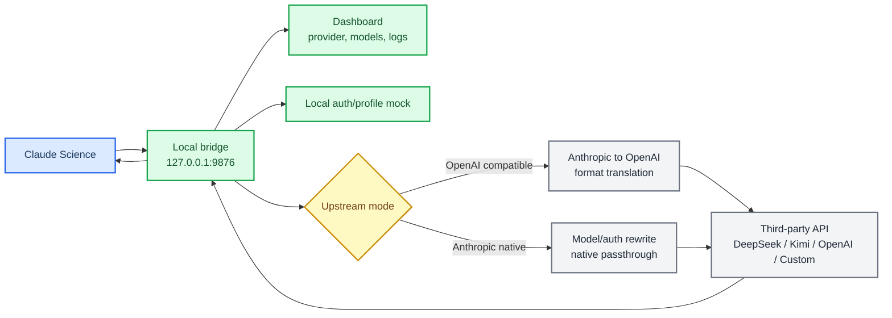

# Claude Science API Bridge

_让 Claude Science 使用 DeepSeek、OpenAI、硅基流动 Kimi 以及任意 OpenAI 兼容第三方 API 的本地桥接工具。_

[最新 macOS DMG](https://github.com/Jyx0208/claude-science-api-bridge/releases/latest) · [Linux 说明](docs/linux.md) · [Agent 手册](AGENTS.md) · [故障排查](docs/troubleshooting.md)

Claude Science API Bridge 是一个运行在本机的 Anthropic-compatible 代理。它接收 Claude Science 发出的 `/v1/messages`、`/v1/models` 和 OAuth/profile 请求，再把推理请求转成第三方 API 能理解的格式。项目同时提供 macOS 一键安装包、Dashboard、模型菜单补丁、读图适配、一键更新，以及给本地 AI agent 执行的完整操作手册。

> **安全默认值：** 默认安装不会修改 Clash、VPN、TUN、DNS、系统代理、`/etc/hosts`、系统证书或 443 端口。

## 快速开始

### macOS 用户

最省事的安装方式：

```bash
curl -fsSL https://raw.githubusercontent.com/Jyx0208/claude-science-api-bridge/main/scripts/install-macos-app.sh | bash
```

这个脚本会下载最新 DMG，复制 App 到 `~/Applications`，移除 Apple quarantine 标记并打开 App。首次打开后按弹窗选择 provider、输入 API key 即可。

也可以手动下载：

1. 打开 [Latest Release](https://github.com/Jyx0208/claude-science-api-bridge/releases/latest)
2. 下载 `Claude.Science.API.Bridge.dmg`
3. 双击 `Claude Science API Bridge.app`
4. 按弹窗选择 provider 并输入 API key

如果 macOS 提示“Apple 无法验证”，这是未公证开源包的常见 Gatekeeper 提示，不代表检测到恶意软件。可使用上面的一行安装命令，或在 Finder 中右键 App 后选择“打开”。

### Linux 用户

Linux 当前支持本地代理、Dashboard、配置管理、systemd user service 和兼容客户端接入。Claude Science 桌面应用本身仍是 macOS 应用，所以 Linux 不会启动 Claude Science，也不会执行 macOS daemon patch。

```bash
git clone https://github.com/Jyx0208/claude-science-api-bridge.git
cd claude-science-api-bridge
./scripts/install-safe.sh
```

安装后给兼容客户端设置：

```bash
export ANTHROPIC_BASE_URL="http://127.0.0.1:9876"
```

详细说明见 [docs/linux.md](docs/linux.md)。

## 这个项目解决什么问题

Claude Science 默认面向 Anthropic API。很多用户希望在 Claude Science 里使用自己的第三方 API，例如 DeepSeek、硅基流动 Kimi、OpenAI、DashScope、智谱或自建 OpenAI-compatible endpoint。本项目提供一个本地桥接层，让 Claude Science 继续以 Anthropic Messages API 的方式工作，而后端实际调用你配置的第三方模型。

核心目标：

- 让 Claude Science 能用第三方 API key 和第三方模型
- 让模型选择菜单显示 Kimi、Qwen、GPT 等真实后端模型名
- 支持流式输出、工具调用、工具结果、图片输入和基础 token 计数
- 过滤常见 provider 泄漏的 reasoning / `<think>` 文本，避免思维链直接出现在对话里
- 尽量让用户不手动折腾，把安装、配置、诊断和验证交给本地 agent
- 坚持安全模式，不默认触碰系统网络配置

## 架构



默认安全路径：

1. 本机启动代理：`http://127.0.0.1:9876`
2. 设置 `ANTHROPIC_BASE_URL=http://127.0.0.1:9876`
3. 生成 Claude Science 可接受的本地 OAuth token
4. 在 Dashboard 中配置 provider、API key、模型映射和图片策略
5. 对 macOS Claude Science daemon 的用户目录复制件做安全补丁，让模型菜单显示第三方模型名
6. 用 `verify-proxy.sh` 验证 health、models、messages、recent requests 和可选图片输入

## 功能概览

| 能力 | 状态 | 说明 |
| --- | --- | --- |
| macOS 一键安装包 | 已支持 | `.app + .dmg`，首次打开即可配置 provider |
| Linux 安全安装 | 已支持 | systemd user service 优先，fallback 用户后台进程兜底 |
| Anthropic to OpenAI 翻译 | 已支持 | 支持流式、非流式、工具调用、工具结果和图片 block |
| Anthropic 原生透传 | 已支持 | 适合有原生 Anthropic endpoint 的 provider |
| 第三方模型菜单 | 已支持 | Claude-facing ID 保持兼容，显示名和真实模型来自第三方 |
| Provider 配置档 | 已支持 | 支持保存、搜索、复制和一键切换 |
| 一键拉取模型列表 | 已支持 | 自动尝试 `/v1/models`、`/models` 和常见兼容路径 |
| 图片输入 | 已支持 | 视觉模型保留图片，文本模型可自动省略图片 |
| reasoning 过滤 | 已支持 | 默认隐藏 `reasoning_content`，过滤常见 `<think>` 泄漏 |
| 本地 path-secret | 已支持 | 可选保护本机推理接口，避免其他本机进程误用 key |
| Dashboard 一键更新 | 已支持 | 检查 GitHub Latest Release，下载 DMG 并安装 |
| 高级 HTTPS 拦截 | 可选 | 仅在用户明确同意后使用，默认不启用 |

## Dashboard 工作流

安装后打开：

```text
http://127.0.0.1:9876/dashboard
```

常用操作都在 Dashboard 中完成：

- `Providers`：添加、编辑、复制、搜索和一键切换 provider
- `模型菜单`：拉取上游模型列表，选择要显示在 Claude Science 里的第三方模型
- `高级设置`：配置图片策略、reasoning 策略、本地 path-secret、LaunchAgent 和更新
- `诊断日志`：查看最近请求、真实后端模型、成功/失败状态

推荐配置流程：

1. 添加 provider
2. 输入 API key 和 base URL
3. 点击“拉取模型列表”
4. 选择真实模型
5. 点击“应用到菜单”或“应用并补丁菜单”
6. 点击“一键测试”
7. 重新打开 Claude Science

## 常见 provider 配置

### DeepSeek

```json
{
  "deepseek_api_key": "REDACTED",
  "deepseek_base_url": "https://api.deepseek.com",
  "deepseek_upstream_mode": "openai",
  "default_backend": "deepseek",
  "force_model": "deepseek-chat",
  "inline_image_policy": "omit"
}
```

### OpenAI

```json
{
  "openai_api_key": "REDACTED",
  "openai_base_url": "https://api.openai.com",
  "openai_upstream_mode": "openai",
  "default_backend": "openai",
  "force_model": "gpt-4o",
  "inline_image_policy": "preserve"
}
```

### 硅基流动 Kimi

```json
{
  "custom_api_key": "REDACTED",
  "custom_base_url": "https://api.siliconflow.cn",
  "custom_upstream_mode": "openai",
  "default_backend": "custom",
  "force_model": "Pro/moonshotai/Kimi-K2.6",
  "model_aliases": [
    {
      "id": "claude-opus-4-8",
      "display_name": "Kimi K2.6 Pro++ (Vision)",
      "backend": "custom",
      "model": "Pro/moonshotai/Kimi-K2.6"
    }
  ],
  "model_list_mode": "aliases",
  "model_menu_strategy": "claude_compatible",
  "inline_image_policy": "preserve",
  "reasoning_content_policy": "never"
}
```

### 任意 OpenAI 兼容 API

```json
{
  "custom_api_key": "REDACTED",
  "custom_base_url": "https://provider.example.com",
  "custom_upstream_mode": "openai",
  "default_backend": "custom",
  "force_model": "provider-model-name",
  "model_aliases": [
    {
      "id": "claude-opus-4-8",
      "display_name": "Provider Model",
      "backend": "custom",
      "model": "provider-model-name"
    }
  ],
  "model_list_mode": "aliases",
  "model_menu_strategy": "claude_compatible",
  "model_token_caps": {
    "provider-model-name": 8192
  },
  "inline_image_policy": "auto",
  "reasoning_content_policy": "never"
}
```

`custom_base_url` 可以写成 `https://provider.example.com`，也可以写成 `https://provider.example.com/v1`，代理会自动规范化。

## 模型菜单如何工作

Claude Science 的模型选择界面有一部分来自本地 daemon 的硬编码列表，所以仅修改 `/v1/models` 不一定够。本项目的安全安装和启动脚本会自动运行：

```bash
./scripts/patch-daemon-models.sh
```

这个脚本只修改用户目录中的 daemon 复制件：

```text
~/.claude-science/bin/claude-science
```

它不会修改 `/Applications/Claude Science.app`，也不会修改 Clash、DNS、系统代理、证书或 443 端口。

推荐保持：

```json
{
  "model_list_mode": "aliases",
  "model_menu_strategy": "claude_compatible"
}
```

这样 Claude Science 看到的模型 ID 仍是它认可的 `claude-opus-4-8`、`claude-sonnet-5` 等槽位，但显示名和实际请求模型来自你的 `model_aliases`。别名命中时会优先于 `force_model`，所以用户在菜单里选择哪个第三方别名，代理就调用对应的真实模型。

## 图片输入和读图能力

Claude Science 发出的 Anthropic 图片 block 会被代理转换成 OpenAI 兼容的 `image_url` 内容。只要后端模型本身支持视觉输入，就可以真正读图。

如果用户在 Claude Science 里选择的是 DeepSeek 或其它文本模型，但请求里包含图片，代理会在 `image_fallback_mode=auto` 时自动切到已配置的视觉模型处理这一次请求。推荐把 `image_fallback_backend=custom`、`image_fallback_model=Pro/moonshotai/Kimi-K2.6`，这样 DeepSeek 文本请求仍走 DeepSeek，带图请求不会因为 DeepSeek text-only 而报错。

`inline_image_policy` 支持：

| 策略 | 行为 | 适用场景 |
| --- | --- | --- |
| `auto` | 文本后端可触发视觉 fallback，Custom/OpenAI 后端按模型能力保留图片 | 不确定模型能力时 |
| `preserve` | 始终发送图片 | Kimi K2.6、GPT-4o、Qwen3-VL 等视觉模型 |
| `omit` | 始终省略图片 | 纯文本便宜模型 |
| `omit_inline` | 只省略 base64 内联图片，保留外部图片 URL | 后端不接受大 base64 时 |

对硅基流动 Kimi，代理会在本机把内联 PNG/WebP/GIF/HEIC 转成 JPEG data URL 再发送，避免部分服务拒绝 PNG base64。图片不会被上传到临时图床，只会随请求发送到你配置的后端 API。

读图验收：

```bash
VERIFY_IMAGE=1 ./scripts/verify-proxy.sh
```

如果当前选择的模型不支持视觉输入，且没有配置可用的视觉 fallback，这一步应失败。需要配置支持视觉的模型，或把图片策略改回 `omit`。

## 本地 path-secret

默认配置保持兼容：

```text
ANTHROPIC_BASE_URL=http://127.0.0.1:9876
```

如果希望限制本机其他进程调用你的第三方 key，可以开启：

```json
{
  "proxy_auth_token": "生成一段随机长字符串",
  "proxy_auth_mode": "required"
}
```

之后启动脚本会自动使用：

```text
ANTHROPIC_BASE_URL=http://127.0.0.1:9876/<secret>
```

日志和 Dashboard 会对 secret 脱敏。未带 secret 的 `/v1/messages`、`/v1/models` 请求会返回 403。

## 更新

Dashboard 会检查 GitHub Latest Release。发现新版本后可直接点击“一键更新”，代理会下载 release 中的 DMG、复制 App 到 `~/Applications` 并重新打开。

维护者发布新版时请保持 DMG asset 文件名稳定：

```text
Claude.Science.API.Bridge.dmg
```

如果 GitHub API 暂时限流，Dashboard 会回退到：

```text
https://github.com/Jyx0208/claude-science-api-bridge/releases/latest/download/Claude.Science.API.Bridge.dmg
```

## 给本地 agent 的完整 prompt

把下面整段发给 Codex、Claude Code 或其他能操作本机终端的 agent。用户只需要提供 API key、provider 和模型偏好，不需要自己安装。

```text
请你帮我在这台机器上配置 Claude Science API Bridge，让 Claude Science 或兼容客户端使用第三方 OpenAI 兼容 API。

仓库地址：
https://github.com/Jyx0208/claude-science-api-bridge

目标：
1. 使用安全模式完成安装和配置。
2. 让 Claude Science 的 Anthropic API 请求走本地代理 127.0.0.1:9876。
3. 后端使用我提供的第三方 API。
4. 如果我要求读图，请使用支持视觉输入的模型，不要把图片替换成文本占位。
5. 让 Claude Science 的模型选择里显示第三方模型别名，而不是只显示 Opus / Sonnet / Haiku。
6. 使用 Dashboard 或 /api/fetch-models 一键获取当前 provider 模型列表，让我选择实际要用的第三方模型。
7. 完成端到端验证，确认 /v1/models 和 /v1/messages 都成功；如果启用读图，还要完成图片请求验证。

我的后端配置：
- provider: DeepSeek / OpenAI / Custom（三选一；硅基流动 Kimi 请选择 Custom；如果我没写，请先问我）
- api_key: 我会单独给你；不要把 key 打印到日志或最终回复里
- base_url: 如果是 DeepSeek 用 https://api.deepseek.com；如果是 OpenAI 用 https://api.openai.com；如果是硅基流动用 https://api.siliconflow.cn；如果是其他 Custom 请先问我
- model: 第三方服务实际支持的模型名；如果我没写，请先问我
- image_support: 如果我需要读图，请确认模型支持视觉输入，并设置 inline_image_policy=preserve 或 auto

安全要求：
1. 先完整阅读仓库结构，以及 README.md、AGENTS.md、docs/agent-runbook.md、docs/troubleshooting.md、scripts/doctor.sh、scripts/install-safe.sh、scripts/verify-proxy.sh。
2. 默认只使用安全模式，不要修改 Clash、VPN、TUN、DNS、系统代理、/etc/hosts、系统证书信任或 443 端口。
3. 不要 reload Clash，不要改任何网络代理配置。
4. 不要输出、提交、总结或截图我的 API key、OAuth token、证书私钥。
5. 如果你认为必须使用高级 HTTPS 拦截，必须先停下来解释原因并单独征求我的明确同意。

执行要求：
1. 如果本机还没有仓库，请 clone 到 ~/.claude-science/proxy；如果已有仓库，请进入该目录并拉取最新 main。
2. 先运行 ./scripts/doctor.sh 做只读诊断。
3. 按 AGENTS.md 和 docs/agent-runbook.md 执行安全安装。
4. 将 API key 和模型配置写入本地 config.json，确保 config.json 不会提交到 Git。
5. 优先调用 /api/fetch-models 获取当前 provider 的模型列表；若 provider 不支持模型列表，再手动使用用户给定模型。
6. 配置 model_aliases、model_list_mode=aliases 和 model_menu_strategy=claude_compatible，让 /v1/models 返回第三方模型显示名，同时使用 Claude Science 更容易放行的菜单槽位。
7. 运行 ./scripts/self-test.sh。
8. 启动或重启代理服务。
9. 运行 ./scripts/verify-proxy.sh 做 health、models、messages 和 recent-requests 验证。
10. 如果模型支持读图，运行 VERIFY_IMAGE=1 ./scripts/verify-proxy.sh 做真实图片输入验证。
11. 如果是 macOS，运行 ./scripts/start-claude-science.sh，让脚本自动刷新 token、补丁本地 daemon 复制件并重启 Claude Science。
12. 再检查 http://127.0.0.1:9876/api/recent-requests，确认请求命中了本地代理。

如果遇到问题：
1. 先运行 ./scripts/doctor.sh。
2. 阅读 docs/troubleshooting.md。
3. 优先修安全模式路径。
4. 不要通过修改 Clash 或系统网络配置来试错。

最终回复请只告诉我：
1. 是否安装成功。
2. 使用的 provider、base_url 和模型名，但不要显示 API key。
3. 验证结果摘要。
4. Dashboard 地址。
5. 如果失败，明确卡在哪一步以及下一步需要我提供什么。
```

## Agent 入口

如果你是 AI agent，请不要让用户手动安装。按顺序读取：

1. [AGENTS.md](AGENTS.md)
2. [docs/agent-runbook.md](docs/agent-runbook.md)
3. [docs/troubleshooting.md](docs/troubleshooting.md)
4. [docs/network-interception.md](docs/network-interception.md)，仅在用户明确允许高级拦截时读取和执行
5. [docs/github-publishing.md](docs/github-publishing.md)，仅在需要发布到 GitHub 时读取

推荐执行：

```bash
./scripts/doctor.sh
./scripts/install-safe.sh
./scripts/self-test.sh
./scripts/verify-proxy.sh
```

`doctor.sh` 是只读诊断脚本；agent 应先运行它，不要猜测用户机器状态。

## 验收标准

下面这些命令由 agent 执行，不要求用户自己运行：

```bash
./scripts/doctor.sh
./scripts/self-test.sh
./scripts/verify-proxy.sh
curl -sS http://127.0.0.1:9876/health
curl -sS http://127.0.0.1:9876/v1/models
curl -sS http://127.0.0.1:9876/v1/messages \
  -H 'Content-Type: application/json' \
  -d '{"model":"claude-sonnet-4-5","max_tokens":32,"messages":[{"role":"user","content":"Reply OK"}]}'
```

如果配置的是视觉模型，还应执行：

```bash
VERIFY_IMAGE=1 ./scripts/verify-proxy.sh
```

最近请求中应能看到成功的后端请求：

```bash
curl -sS http://127.0.0.1:9876/api/recent-requests
```

## 开发和测试

前台启动：

```bash
./start.sh
```

自测：

```bash
./scripts/self-test.sh
./scripts/verify-proxy.sh
```

构建 macOS 发布包：

```bash
printf '0.2.6\n' > VERSION
./scripts/build-macos-release.sh
./scripts/smoke-test-release-package.sh
```

如需 Apple Developer ID 签名和公证：

```bash
DEVELOPER_ID_APPLICATION="Developer ID Application: Your Name (TEAMID)" \
NOTARYTOOL_PROFILE="your-notarytool-profile" \
./scripts/notarize-macos-release.sh
```

发布包不会包含 `config.json`、证书、日志、`.env` 或 Git 历史。详细说明见 [docs/release-packaging.md](docs/release-packaging.md)。

## 项目结构

```text
.
├── AGENTS.md
├── README.md
├── SECURITY.md
├── VERSION
├── config.example.json
├── proxy.py
├── setup-token.py
├── start.sh
├── install.sh
├── setup-network.sh
├── requirements.txt
├── scripts/
│   ├── doctor.sh
│   ├── install-safe.sh
│   ├── patch-daemon-auth.sh
│   ├── patch-daemon-models.sh
│   ├── restore-daemon-auth.sh
│   ├── self-test.sh
│   ├── start-claude-science.sh
│   ├── uninstall.sh
│   └── verify-proxy.sh
├── docs/
│   ├── agent-runbook.md
│   ├── github-publishing.md
│   ├── linux.md
│   ├── network-interception.md
│   ├── release-packaging.md
│   └── troubleshooting.md
├── packaging/
│   └── macos/
│       ├── app-launcher.sh
│       └── build-release.sh
└── static/
    └── dashboard.html
```

## 不要提交的文件

`.gitignore` 已排除本地敏感文件和运行态文件：

- `config.json`
- `.env`
- `certs/`
- `*.plist`
- 日志
- Python 缓存
- `dist/`

发布前请确认：

```bash
git status --ignored
```

确保 API key、OAuth token、证书私钥和本地日志没有被加入 Git。

## 相关项目

本项目参考了 cc-switch 的 provider 配置档、模型列表拉取、endpoint 候选推导和模型映射思路，同时加入 Claude Science 专用的 OAuth/profile mock、Anthropic/OpenAI 翻译、daemon 模型菜单补丁和安全安装脚本。

- [cc-switch](https://github.com/farion1231/cc-switch)
- [CSSwitch](https://github.com/SuperJJ007/CSswitch)

## 许可证

MIT。见 [LICENSE](LICENSE)。
